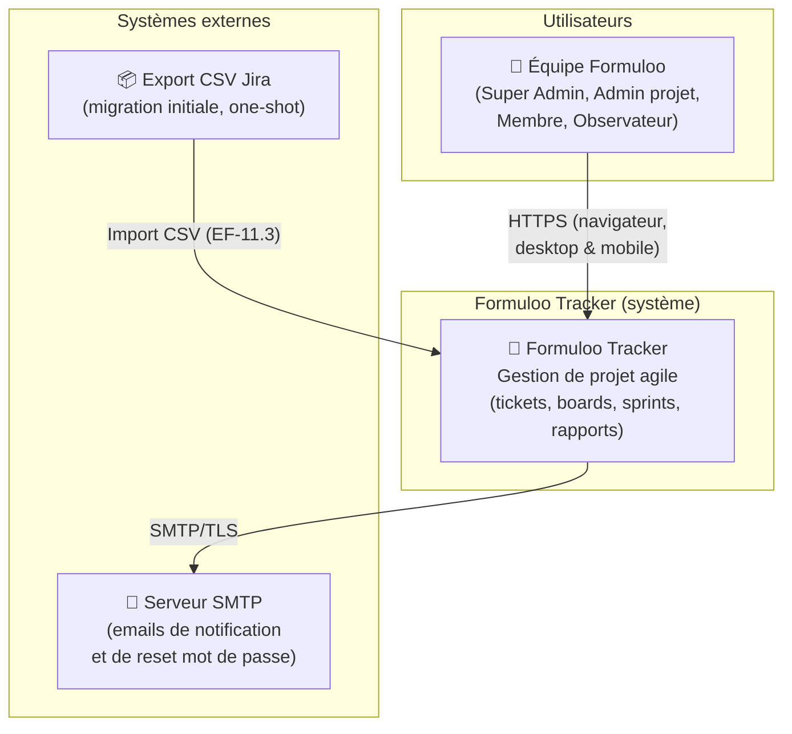
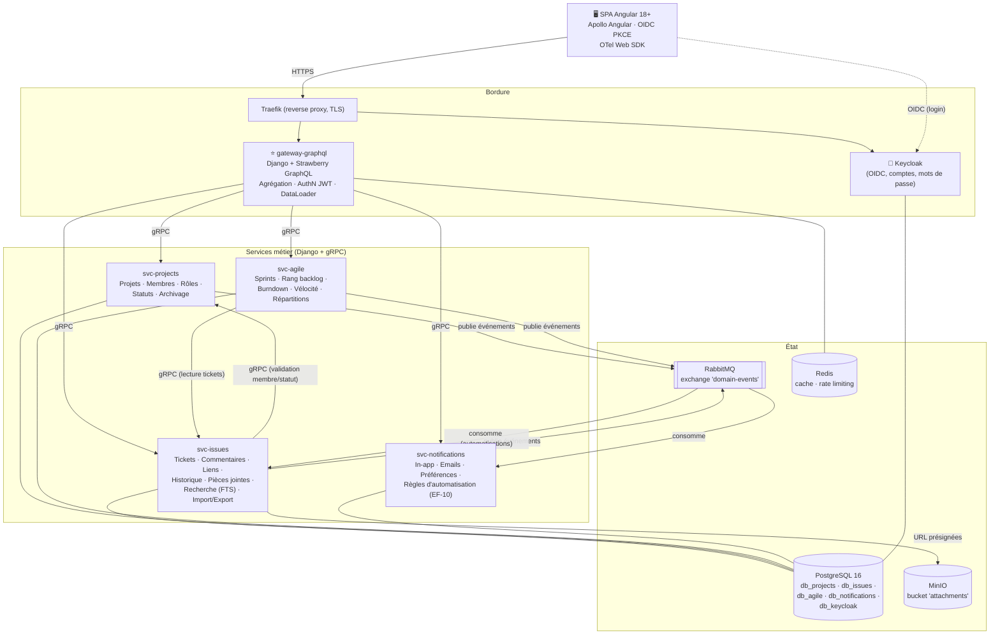
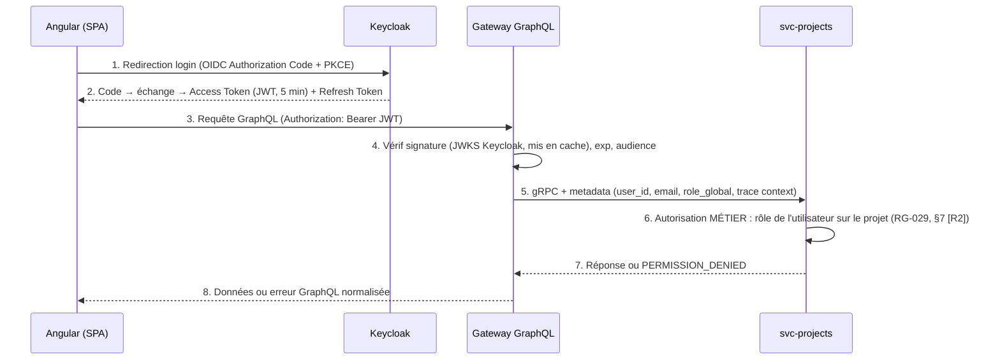
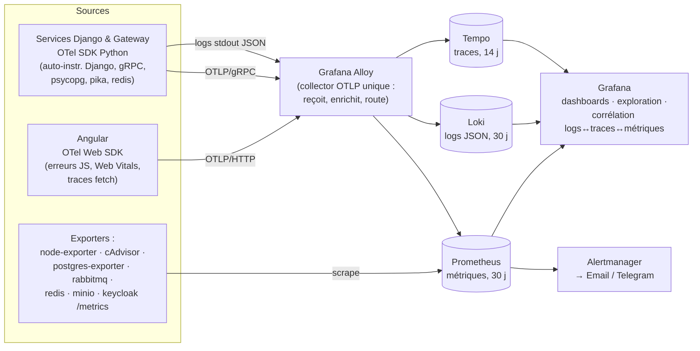

# Document d'Architecture Technique (DAT)
# Formuloo Tracker — MVP V1.0

| Champ | Valeur |
|---|---|
| **Produit** | Formuloo Tracker (mini Jira interne) |
| **Type de document** | Document d'Architecture Technique (DAT) |
| **Structure** | Inspirée du modèle **arc42** + ADR (Architecture Decision Records) |
| **Version** | 1.6 |
| **Date** | 17/07/2026 |
| **Statut** | Draft — soumis à validation |
| **Documents parents** | `01-analyse-fonctionnalites-jira-et-mvp.md` [R1], `02-specification-fonctionnelle-formuloo-tracker.md` [R2], `04-backlog-mvp-formuloo-tracker.md` [R4], `Formuloo Tracker.html` (maquette) [R5] |
| **Contraintes imposées** | Angular · PrimeNG · Django · GraphQL · gRPC · Microservices · 100 % open source · Observabilité Grafana · Keycloak · Docker Compose → Kubernetes |

## Historique des révisions

| Version | Date | Auteur | Modifications |
|---|---|---|---|
| 1.0 | 03/07/2026 | Formuloo | Version initiale complète |
| 1.1 | 17/07/2026 | Formuloo | Intégration des décisions de cadrage : ADR-010→020 (§2), versions de référence complétées (§16.2), Design System Formuloo (§16.4). |
| 1.2 | 17/07/2026 | Formuloo | ADR-010 révisé : modèle de branches GitFlow (main/develop/MR + rebase obligatoire), aligné sur `MEMORY.md`. |
| 1.3 | 17/07/2026 | Formuloo | Plateforme : GitLab au lieu de GitHub (ADR-021) — protection de branches gratuite sur dépôt privé ; §11 (CI/registre) et §12 (dépendances) mis à jour. |
| 1.4 | 17/07/2026 | Formuloo | Plateforme : décision finale **GitHub** (ADR-021 réécrit) ; §11/§12 revenus à GitHub Actions / ghcr.io / Dependabot. Protection de branches sur dépôt privé = GitHub Pro ou dépôt public, sinon hooks locaux. |
| 1.5 | 17/07/2026 | Formuloo | Dépôt **public** (ADR-021) : protection de branches gratuite ⇒ E1 applicable côté serveur sans coût ; §11 mis à jour. |
| 1.6 | 17/07/2026 | Formuloo | ADR-022 : indépendance du frontend (schéma-first + mock MSW) en vue du split post-MVP ; structure `/contracts` ; outillage front (MSW, GraphQL Code Generator) au §16.2. |

---

## Table des matières

1. Introduction, objectifs et contraintes
2. Décisions d'architecture (ADR)
3. Vue contexte (C4 — niveau 1)
4. Vue conteneurs & découpage en microservices (C4 — niveau 2)
5. Communication : GraphQL, gRPC, événements
6. Données et persistance
7. Authentification et autorisation (Keycloak)
8. **Observabilité** (logs, métriques, traces, alerting)
9. Déploiement — Phase 1 : Docker Compose
10. Déploiement — Phase 2 : Kubernetes (k3s)
11. CI/CD et gestion du code
12. Sécurité
13. Performance, scalabilité et résilience
14. Sauvegardes et reprise d'activité
15. Risques, dette assumée et points de vigilance
16. Annexes (matrice des ports, conventions, coûts)

---

## 1. Introduction, objectifs et contraintes

### 1.1 Objectif du document
Définir l'architecture technique du MVP de Formuloo Tracker : découpage en services, technologies, flux, sécurité, observabilité et stratégie de déploiement. Ce document est le référentiel de l'équipe de développement et d'exploitation ; il implémente les exigences fonctionnelles [R2] et non fonctionnelles (ENF-01 → ENF-14).

### 1.2 Contraintes d'architecture (non négociables)

| ID | Contrainte | Origine |
|---|---|---|
| CT-1 | Frontend **Angular** | Décision Formuloo |
| CT-2 | Backend **Django** (Python) pour tous les services métier | Décision Formuloo |
| CT-3 | API exposée au frontend en **GraphQL** | Décision Formuloo |
| CT-4 | Communication inter-services synchrone en **gRPC** | Décision Formuloo |
| CT-5 | **Architecture microservices** | Décision Formuloo |
| CT-6 | Stack **100 % gratuite / open source** (aucune licence, aucun SaaS payant) | Budget |
| CT-7 | Observabilité de premier ordre : **Prometheus + Loki + Tempo + Grafana** | Décision Formuloo |
| CT-8 | Authentification via **Keycloak** (SSO dédié) | Décision Formuloo |
| CT-9 | Déploiement **Docker Compose** au départ, **Kubernetes (k3s)** à terme | Décision Formuloo |
| CT-10 | Connectivité parfois instable (Douala) → frugalité réseau, tolérance aux latences | ENF-10 |

### 1.3 Objectifs de qualité prioritaires (issus de [R2])

| Priorité | Attribut | Cible |
|---|---|---|
| 1 | Sécurité / contrôle d'accès | Vérification serveur systématique, OWASP ASVS N1 (ENF-05) |
| 2 | Observabilité / exploitabilité | Tout incident diagnosticable en < 15 min via Grafana (logs + traces corrélés) |
| 3 | Performance | Board 200 tickets < 2 s P95 ; écriture ticket < 500 ms P95 (ENF-01/02) |
| 4 | Évolutivité | Passage Compose → k3s **sans réécriture** ; V1.1/V2 sans refonte |
| 5 | Simplicité d'exploitation | Une petite équipe doit pouvoir opérer la plateforme |

---

## 2. Décisions d'architecture (ADR)

Chaque décision est tracée au format court : contexte → décision → conséquences.

### ADR-001 — Nombre de microservices volontairement restreint (5 + gateway)
- **Contexte** : CT-5 impose les microservices ; mais un MVP interne opéré par une petite équipe ne supporte pas 15 services (coût cognitif, réseau de pannes, déploiements).
- **Décision** : découpage en **5 services métier + 1 gateway GraphQL**, alignés sur les capacités métier de [R2] (voir §4). Toute création de service supplémentaire exige un ADR.
- **Conséquences** : ✔ exploitation réaliste, frontières claires ; ✖ certains regroupements (tickets + recherche) devront peut-être être scindés en V2.

### ADR-002 — Django partout, en deux rôles distincts
- **Contexte** : CT-2 ; Django est un framework HTTP, or les services internes parlent gRPC.
- **Décision** : chaque service métier est un projet Django utilisé pour **l'ORM, les migrations et l'admin**, mais expose un **serveur gRPC** (`grpcio` + protobuf) comme interface principale. Le gateway est un Django classique exposant GraphQL via **Strawberry Django**.
- **Conséquences** : ✔ un seul écosystème (Python/Django) à maîtriser, migrations robustes ; ✖ le serveur gRPC tourne à côté du cycle requête/réponse Django standard (process dédié via `python manage.py grpcserver`).

### ADR-003 — Synchrone gRPC + asynchrone RabbitMQ
- **Contexte** : CT-4 couvre les appels requête/réponse ; mais notifications, historique et automatisations sont par nature **événementiels** (EF-9, EF-10, EF-3.9).
- **Décision** : gRPC pour toutes les lectures/écritures synchrones inter-services ; **RabbitMQ** (open source) comme bus d'événements pour les faits métier (`ticket.cree`, `ticket.transitionne`, `commentaire.ajoute`, `mention.detectee`, `sprint.clos`...). Les événements sont sérialisés en protobuf (mêmes contrats).
- **Conséquences** : ✔ le service notifications ne ralentit jamais l'écriture d'un ticket ; ✔ automatisations découplées ; ✖ un composant de plus à opérer (mais nécessaire).

### ADR-004 — Database-per-service sur une instance PostgreSQL unique
- **Contexte** : le pattern microservices exige l'isolation des données ; le budget et l'exploitation exigent la simplicité.
- **Décision** : **une instance PostgreSQL 16**, mais **une base de données distincte par service** (`db_projects`, `db_issues`, `db_agile`, `db_notifications`, `db_keycloak`). Aucun service n'accède à la base d'un autre — toute donnée étrangère passe par gRPC ou par événement.
- **Conséquences** : ✔ isolation logique réelle, migration facile vers des instances séparées si besoin ; ✖ pas de jointure inter-domaines en SQL (agrégation au gateway — assumé).

### ADR-005 — Keycloak comme fournisseur d'identité (OIDC)
- **Contexte** : CT-8 ; [R2] exige comptes illimités, rôles, désactivation (EF-1).
- **Décision** : Keycloak gère **authentification** (OIDC/PKCE côté Angular), utilisateurs, mots de passe, reset par email. Les **autorisations métier** (rôle par projet : Admin/Membre/Observateur) restent dans `svc-projects` — Keycloak ne porte que le rôle global (`super_admin`).
- **Conséquences** : ✔ SSO prêt, sécurité éprouvée, zéro code de gestion de mots de passe ; ✖ Keycloak est gourmand (~512 Mo–1 Go RAM) et doit être supervisé comme les autres.

### ADR-006 — Observabilité : OpenTelemetry + stack Grafana (LGTM)
- **Contexte** : CT-7 ; priorité qualité n°2.
- **Décision** : instrumentation **OpenTelemetry** (SDK Python et Angular), collecte par **Grafana Alloy** (collector OTLP), stockage **Prometheus** (métriques), **Loki** (logs), **Tempo** (traces), visualisation/alerting **Grafana + Alertmanager**. Détail au §8.
- **Conséquences** : ✔ corrélation logs↔traces↔métriques native ; ✔ 100 % open source ; ✖ ~2 Go de RAM à réserver à l'observabilité.

### ADR-007 — MinIO pour les pièces jointes
- **Contexte** : EF-3.8 (pièces jointes) ; stockage disque local incompatible avec la cible Kubernetes multi-nœuds.
- **Décision** : **MinIO** (S3 open source) dès la phase Compose ; les services ne stockent que des métadonnées + URL présignées.
- **Conséquences** : ✔ portabilité Compose→k8s sans changement de code ; ✔ quotas et versioning natifs.

### ADR-008 — Compose d'abord, k3s ensuite, mêmes images
- **Contexte** : CT-9.
- **Décision** : les **mêmes images Docker** (multi-stage, non-root, tags immuables) servent aux deux phases. Douze facteurs respectés : configuration par variables d'environnement uniquement, logs sur stdout, services sans état (état = PostgreSQL/MinIO/RabbitMQ).
- **Conséquences** : ✔ migration k3s = écriture des manifests/Helm, zéro refonte applicative.

### ADR-009 — Monorepo avec contrats partagés
- **Contexte** : 6 dépôts séparés = friction pour une petite équipe ; les contrats (gRPC et GraphQL) doivent être la source de vérité.
- **Décision** : **monorepo** Git : `/protos` (contrats gRPC), `/contracts/graphql` (schéma GraphQL publié), `/services/*`, `/frontend`, `/deploy` (compose, helm), `/docs`. Génération de code (protobuf, types GraphQL) en CI.
- **Conséquences** : ✔ atomicité des changements de contrat ; ✖ pipeline CI à filtrer par dossier. **Conçu pour le split post-MVP** : frontend et backend seront extraits en dépôts distincts (équipes séparées) ; le **schéma GraphQL est la frontière d'intégration** et le frontend est prévu pour tourner de façon autonome (voir ADR-022).

> **ADR-010 → ADR-020 (ajoutés en v1.1)** — décisions issues de la session de cadrage, complétant les précédentes sans les contredire.

### ADR-010 — Modèle de branches : GitFlow (main / develop / MR)
- **Contexte** : décision du propriétaire (Steve). `main` et `develop` doivent être des branches protégées et stables ; le flux de contribution doit être cadré et auditable. *(Remplace la proposition initiale « trunk-based » de la v1.1.)*
- **Décision** : **modèle main + develop** — `main` et `develop` **inviolables** (aucun commit direct) ; `develop` créée à partir de `main`, **toute branche de travail créée à partir de `develop`** ; une **branche dédiée par implémentation** (`feat/ft-<id>-<slug>`, `fix/…`, `chore/…`) ; **rebase obligatoire sur `develop` à jour** avant push ; fusion **uniquement par MR** ciblant `develop` ; `develop` → `main` **uniquement par MR**, puis **tag SemVer** sur `main`. Historique **linéaire** (squash/rebase). Règles complètes et garde-fous d'exécution : **`MEMORY.md`**.
- **Conséquences** : ✔ branches stables et protégées, contributions auditables, releases contrôlées ; ✔ règles opposables (protection de plateforme + hooks Git) ; ✖ plus cérémonieux que le trunk-based (davantage de MR et de rebases) — assumé par le propriétaire pour la sûreté.

### ADR-011 — Outillage du monorepo : Taskfile + scripts (pas de Nx)
- **Contexte** : ADR-009 fixe la structure du monorepo mais pas l'orchestrateur ; backend à ~80 % Python.
- **Décision** : orchestration par **Taskfile** (ou Makefile) + scripts, **CI filtrée par dossier**. **Pas de Nx** (fort surtout côté Angular, support Python partiel).
- **Conséquences** : ✔ transparent, polyglotte, chaque service reste un projet Django standard ; ✖ pas de cache de tâches distribué (les caches Docker/pip/pnpm suffisent au MVP).

### ADR-012 — Bibliothèque UI : PrimeNG (preset Aura)
- **Contexte** : frontend Angular (CT-1) sans lib de composants désignée ; la maquette [R5] fixe un Design System précis (§16.4).
- **Décision** : **PrimeNG** (dernière stable, à figer), **mode stylé** avec le **preset Aura** (`@primeng/themes`) personnalisé par les design tokens de la maquette ; icônes **PrimeIcons**. 100 % gratuit (Apache-2.0) ; templates payants (hors Sakai) exclus (CT-6).
- **Conséquences** : ✔ composants riches couvrant les 26 écrans, thème clair/sombre natif ; ✖ « habillage Formuloo » obtenu par surcharge du preset, pas par un thème acheté.

### ADR-013 — Gestion d'état frontend : Signals + cache Apollo
- **Contexte** : le DAT prévoit Apollo Angular (client GraphQL) sans trancher la gestion d'état applicatif.
- **Décision** : **état serveur** dans le **cache normalisé Apollo** ; **état d'UI local** en **Angular Signals** ; **NgRx SignalStore** en réserve pour un écran à état client complexe (candidat : board DnD, FT-32).
- **Conséquences** : ✔ boilerplate minimal, temps réel géré par Apollo ; ✖ discipline pour ne pas dupliquer dans des signals ce qui vit déjà dans le cache.

### ADR-014 — Langue des identifiants : domaine FR, technique EN
- **Contexte** : contrats déjà amorcés en français (`resume`, `etiquettes`, `statut_id`, `creerTicket`) ; règles RG en français ; équipe francophone.
- **Décision** : **langage ubiquitaire (DDD)** — **domaine métier en français** (`Ticket`, `Sprint`, `Statut`, `Priorite`…), **couche technique/infra en anglais** (`Service`, `Repository`, `Handler`, `Gateway`, `outbox`…). **Une seule convention par couche.** Schéma GraphQL et protos restent en français métier.
- **Conséquences** : ✔ vocabulaire métier sans traduction, interop anglaise côté plomberie ; ✖ exige un glossaire FR↔concept et de la rigueur de revue.

### ADR-015 — Éditeur de texte riche : Tiptap
- **Contexte** : EF-3.1 (description riche basique) + EF-3.7 (mentions `@`).
- **Décision** : **Tiptap** (MIT, ProseMirror) via `ngx-tiptap`, extension **Mention** ; contenu stocké en **HTML assaini côté serveur** (anti-XSS, ENF-05).
- **Conséquences** : ✔ couvre le périmètre « basique » + mentions ; ✖ dépendance front à figer et tester (snapshot de rendu).

### ADR-016 — Internationalisation : Transloco (FR au MVP)
- **Contexte** : français au MVP (C-1/ENF-13), anglais en V1.1 (M-06).
- **Décision** : **Transloco** (i18n runtime, MIT), **une seule langue (fr) livrée** mais tous les libellés via clés ; dates `JJ/MM/AAAA`, fuseau Afrique/Douala. Préféré à l'i18n natif (compile-time) pour la souplesse V1.1.
- **Conséquences** : ✔ ajout de l'anglais = un fichier de traduction, zéro refonte ; ✖ surcoût runtime négligeable (dictionnaires lazy-loadés, compatible CT-10).

### ADR-017 — Gestionnaires de paquets & versions figées
- **Contexte** : reproductibilité (ADR-008) et frugalité CI.
- **Décision** : **pnpm** (front) + **uv** (chaque service Python) ; **Node 20 LTS**, **Python 3.12** ; versions figées au démarrage (`.nvmrc`, `.python-version`, lockfiles commités ; infra épinglée par tag immuable, §16.2).
- **Conséquences** : ✔ builds reproductibles, CI plus rapide ; ✖ deux gestionnaires (un par écosystème, sans recouvrement).

### ADR-018 — Rigueur TDD & gates CI : strict métier, pragmatique UI
- **Contexte** : le backlog [R4] vise test-first partout + 100 % sur les RG (ENF-11) ; en solo, l'orthodoxie TDD sur chaque détail d'UI coûte cher.
- **Décision** : **TDD strict et bloquant sur le métier** (RG et handlers gRPC test-first, **100 % RG-020→030 en CI**, test de permission par mutation) ; **pragmatique sur l'UI** (tests de composants obligatoires, test-first recommandé non imposé ; gate global = pas de régression de couverture). E2E Playwright : 1 parcours critique par écran.
- **Conséquences** : ✔ justesse là où le risque est réel, vélocité sur le pixel ; ✖ écart explicite assumé vs « test-first partout » du backlog, à réévaluer en rétro. *(Détail dans [R4] §2.)*

### ADR-019 — Conventions Git : Conventional Commits + SemVer + PR
- **Contexte** : traçabilité, changelog, discipline même en solo.
- **Décision** : **Conventional Commits** (`feat(issues): FT-18 …`), **SemVer** global + tags `vX.Y.Z`, images Docker taguées `version+SHA` (§9.2), **PR obligatoire même en solo** (auto-revue + CI garde-barrière), changelog généré depuis les commits, hook `commitlint`.
- **Conséquences** : ✔ historique lisible, releases traçables ; ✖ légère discipline de rédaction (outillée).

### ADR-020 — Hébergement initial : local d'abord
- **Contexte** : DAT recommande un VPS 4 vCPU/16 Go ; dev sur MacBook Pro ; connectivité Douala instable (CT-10) ; budget 0 (CT-6).
- **Décision** : **dev et démonstration en local via Docker Compose** pour le MVP initial, avec les **profils du §9.1** (profil `app` + état toujours actifs, profil **`obs` (LGTM) à la demande** pour économiser ~2,5 Go). **VPS provisionné plus tard** (préprod partageable, sprint pilote FT-64) — migration sans refonte (ADR-008).
- **Conséquences** : ✔ zéro coût et zéro dépendance réseau pour développer ; ✔ infra identique (mêmes images) ; ✖ pré-requis ≥ 16 Go RAM (pile complète ≈ 10 Go) d'où le profil `obs` optionnel ; ✖ pas d'URL partageable tant que le VPS n'est pas là.

### ADR-021 — Plateforme : GitHub, dépôt public (décision finale)
- **Contexte** : le propriétaire (Steve) retient **GitHub**. La protection de branches / rulesets de GitHub n'est pas disponible sur les dépôts *privés* en plan gratuit (nécessiterait Pro), mais elle est **gratuite sur les dépôts publics**.
- **Décision** : **GitHub, dépôt public** — la **protection de branches est gratuite**, donc E1 est **pleinement applicable côté serveur** sans coût. CI **GitHub Actions** (minutes illimitées sur dépôt public), **GitHub Container Registry (ghcr.io)**, suivi des dépendances **Dependabot**. Terminologie : **PR** (Pull Request), équivalente à la « MR » des règles de `MEMORY.md`. Le script `scripts/setup-github.sh` applique la protection de `main` et `develop`.
- **Portée « public »** : seul le **code source** est public ; les **données applicatives restent auto-hébergées et privées** (l'auto-hébergement de [R2] est inchangé). Aucun secret dans Git (`MEMORY.md` S1/S2). Un passage ultérieur en **privé** resterait possible, mais exigerait alors **GitHub Pro** pour conserver la protection.
- **Conséquences** : ✔ E1 opposable côté serveur, **coût nul** (CT-6 respecté), minutes CI illimitées ; ✔ Actions / ghcr.io / Dependabot natifs ; ✖ code source visible publiquement (assumé) — prévoir un fichier `LICENSE` avant diffusion large.

### ADR-022 — Indépendance du frontend : schéma-first + couche de mock (MSW)
- **Contexte** : après le MVP, **frontend et backend seront repris par des équipes distinctes, dans des dépôts séparés**. Le frontend doit pouvoir être développé, exécuté, démontré et testé **sans backend** — au MVP (avant que les services existent, cf. méthode frontend-driven du backlog §2) comme après le split.
- **Décision** : le frontend dépend du **schéma GraphQL** (contrat), jamais d'un backend qui tourne. (1) Le **schéma SDL** est généré depuis le gateway et publié comme artefact versionné dans `/contracts/graphql/schema.graphql`. (2) **GraphQL Code Generator** produit les types et opérations typées du front à partir du SDL. (3) **MSW (Mock Service Worker)** avec handlers GraphQL fournit une **couche de mock unique** réutilisée en `ng serve` (mode mock, bascule `environment.apiMode`), en tests Jest et en E2E Playwright. (4) Des **fixtures réalistes** calquées sur les personas ([R2] §3.2) et la maquette ([R5]) constituent le jeu de données de démo. (5) Une vérification CI valide les opérations du front contre le SDL (anti-dérive mock ↔ API).
- **Conséquences** : ✔ le frontend build / tourne / se teste **sans aucun backend** ; ✔ `/frontend` autonome ⇒ extraction en dépôt séparé quasi triviale au split ; ✔ chaque story démontrable avant l'implémentation du service ; ✖ discipline : garder les mocks fidèles au SDL (vérif CI) et le SDL comme unique contrat. Un **serveur de mock GraphQL autonome** (`graphql-yoga` + `@graphql-tools/mock`) est **repoussé au split**, si un endpoint réseau devient nécessaire.

---

## 3. Vue contexte (C4 — niveau 1)



---

## 4. Vue conteneurs & découpage en microservices (C4 — niveau 2)

### 4.1 Diagramme d'ensemble



### 4.2 Responsabilités détaillées

| Service | Capacités métier ([R2]) | Base | Expose | Consomme |
|---|---|---|---|---|
| **gateway-graphql** | Schéma GraphQL unique, agrégation, contrôle du JWT, DataLoader (anti N+1), rate limiting, subscriptions temps réel (notifications) | — (Redis cache) | GraphQL /graphql (HTTP + WS) | gRPC des 4 services |
| **svc-projects** | EF-2 (projets, clé, archivage, statuts), rôles par projet (§7 de [R2]), profils applicatifs (miroir Keycloak) | `db_projects` | gRPC `projects.v1` | événements Keycloak (webhook admin) |
| **svc-issues** | EF-3 (tickets, commentaires, liens, historique, pièces jointes), EF-4 (transitions), EF-7 (recherche FTS PostgreSQL), EF-11.3/11.4 (import CSV Jira, exports) | `db_issues` | gRPC `issues.v1` | gRPC projects ; événements (automatisations EF-10 côté écriture) |
| **svc-agile** | EF-6 (sprints, backlog, rangs), EF-8.2→8.4 (burndown, vélocité, répartitions — snapshots quotidiens) | `db_agile` | gRPC `agile.v1` | gRPC issues ; événements `ticket.*` |
| **svc-notifications** | EF-9 (in-app, email, préférences), EF-10.1.d ; worker RabbitMQ + envoi SMTP | `db_notifications` | gRPC `notifications.v1` | événements `domain-events` |
| **Keycloak** | EF-1.2/1.3 (login, reset), stockage identités | `db_keycloak` | OIDC /realms/formuloo | — |

**Règle d'or** : un service est **propriétaire exclusif** de ses tables. Le gateway ne contient **aucune** logique métier — uniquement composition, autorisation d'accès et mise en forme.

---

## 5. Communication : GraphQL, gRPC, événements

### 5.1 Vue d'ensemble des protocoles

| Lien | Protocole | Justification |
|---|---|---|
| Navigateur → Gateway | **GraphQL** sur HTTPS (+ WebSocket pour subscriptions) | CT-3 ; le front compose librement ses vues (board, backlog) en 1 requête → frugalité réseau (CT-10) |
| Gateway → Services | **gRPC** (HTTP/2, protobuf) | CT-4 ; typage fort, latence faible, streaming |
| Service → Service | **gRPC** (strictement limité, cf. §5.4) | idem |
| Faits métier | **RabbitMQ** (topic exchange `domain-events`, payload protobuf) | ADR-003 ; découplage notifications/automatisations |
| Fichiers | URL **présignées MinIO** (upload/download direct navigateur↔MinIO) | Les fichiers ne transitent jamais par le gateway |

### 5.2 Contrats gRPC (extrait — dépôt `/protos`)

```protobuf
syntax = "proto3";
package formuloo.issues.v1;

service IssuesService {
  rpc GetIssue(GetIssueRequest) returns (Issue);
  rpc ListIssues(ListIssuesRequest) returns (ListIssuesResponse);   // filtres EF-7.2, pagination par curseur
  rpc CreateIssue(CreateIssueRequest) returns (Issue);
  rpc UpdateIssueField(UpdateIssueFieldRequest) returns (Issue);    // édition champ par champ (EF-3.3)
  rpc TransitionIssue(TransitionIssueRequest) returns (Issue);      // EF-4
  rpc AddComment(AddCommentRequest) returns (Comment);
  rpc LinkIssues(LinkIssuesRequest) returns (IssueLink);            // RG-028 : lien inverse automatique
  rpc GetIssueHistory(GetIssueHistoryRequest) returns (stream HistoryEntry);
  rpc CreateAttachmentUploadUrl(CreateAttachmentUploadUrlRequest) returns (PresignedUrl);
  rpc SearchIssues(SearchIssuesRequest) returns (ListIssuesResponse); // FTS EF-7.1
  rpc BulkImport(stream ImportRow) returns (ImportReport);           // EF-11.3 (streaming côté client)
}

message Issue {
  string id = 1;
  string cle = 2;               // "FORM-42" — immuable (EF-3.2)
  string projet_id = 3;
  IssueType type = 4;           // EPIC | STORY | TACHE | BUG | SOUS_TACHE
  string resume = 5;
  string description = 6;
  Priorite priorite = 7;
  repeated string etiquettes = 8;
  string statut_id = 9;
  optional string assigne_id = 10;
  string rapporteur_id = 11;
  optional string parent_id = 12;
  optional string sprint_id = 13;
  optional int32 estimation_points = 14;
  optional string echeance = 15;         // ISO-8601, UTC (RG-026)
  google.protobuf.Timestamp cree_le = 16;
  google.protobuf.Timestamp modifie_le = 17;
}
```

**Conventions de contrat** : versionnement par package (`*.v1`) ; champs jamais supprimés ni renumérotés (dépréciation par `reserved`) ; erreurs via `google.rpc.Status` avec codes canoniques (`NOT_FOUND`, `PERMISSION_DENIED`, `FAILED_PRECONDITION` pour les règles RG-xxx violées).

### 5.3 Schéma GraphQL (extrait côté gateway)

```graphql
type Query {
  moi: Utilisateur!
  projet(cle: String!): Projet
  ticket(cle: String!): Ticket                    # EF-7.5 : accès direct par clé
  rechercheTickets(criteres: CriteresRecherche!, apres: String, premier: Int = 25): TicketConnection!
  board(projetCle: String!, sprintActif: Boolean = false): Board!
  backlog(projetCle: String!): Backlog!
  rapportBurndown(sprintId: ID!): Burndown!
  rapportVelocite(projetCle: String!, nDerniersSprints: Int = 7): Velocite!
}

type Mutation {
  creerTicket(entree: CreerTicketEntree!): Ticket!
  modifierChampTicket(cle: String!, champ: ChampTicket!, valeur: JSON): Ticket!
  transitionnerTicket(cle: String!, statutId: ID!): Ticket!
  commenter(cle: String!, contenu: String!): Commentaire!
  demarrerSprint(sprintId: ID!, debut: Date!, fin: Date!): Sprint!
  cloturerSprint(sprintId: ID!, destinationNonTermines: DestinationSprint!): RapportSprint!
  # ... (couverture complète EF-1 → EF-11)
}

type Subscription {
  notifications: Notification!    # EF-9.1 — temps réel via WebSocket
}
```

Le gateway applique : validation du JWT (§7), **DataLoader par requête** (regroupe les `GetIssue`/`GetUser` en appels gRPC batch), limite de profondeur/complexité des requêtes GraphQL, persisted queries en option (frugalité CT-10).

### 5.4 Règles d'appels inter-services (anti-plat de spaghetti)

1. Le **gateway** peut appeler tout service.
2. `svc-issues` → `svc-projects` uniquement (vérifier membre/rôle/statut valide).
3. `svc-agile` → `svc-issues` uniquement (lecture des tickets d'un sprint).
4. **Aucun autre appel synchrone** n'est autorisé ; tout le reste passe par événements.
5. Tout appel gRPC a un **deadline explicite** (défaut 2 s) et le gateway applique un **circuit breaker** par service (dégradation partielle plutôt que page blanche).

### 5.5 Événements métier (topic exchange `domain-events`)

| Routing key | Producteur | Consommateurs | Usage |
|---|---|---|---|
| `issue.created` | svc-issues | notifications, agile | notif assignation, snapshot burndown |
| `issue.transitioned` | svc-issues | notifications, agile | EF-9.1, EF-10.b/d, burndown |
| `issue.commented` / `issue.mentioned` | svc-issues | notifications | EF-9.1/9.2 |
| `issue.assigned` | svc-issues | notifications | EF-9.1/9.2 |
| `sprint.started` / `sprint.closed` | svc-agile | notifications, issues | rapports, rattachements |
| `project.member_added` | svc-projects | notifications | information du nouvel arrivant |

Garanties : publication **transactional outbox** (l'événement est écrit en base dans la même transaction que le fait métier, puis relayé — pas d'événement fantôme) ; consommateurs **idempotents** (clé de déduplication = id d'événement) ; **dead-letter queue** supervisée (§8.5).

---

## 6. Données et persistance

| Magasin | Contenu | Points clés |
|---|---|---|
| PostgreSQL 16 — `db_projects` | projets, membres+rôles, statuts, profils | contrainte d'unicité clé projet ; RG-011 en contrainte applicative |
| PostgreSQL 16 — `db_issues` | tickets, commentaires, liens, historique, métadonnées PJ | séquence par projet pour `CLE-N` (RG jamais réutilisé) ; index GIN `tsvector` (FR) pour la recherche EF-7.1 ; table `outbox` |
| PostgreSQL 16 — `db_agile` | sprints, rangs backlog (clé de tri lexicographique — RG-030), snapshots quotidiens burndown | tâche planifiée (Celery beat) pour les snapshots |
| PostgreSQL 16 — `db_notifications` | notifications, préférences, règles d'automatisation actives | purge des notifications lues > 90 j |
| MinIO — `attachments/` | fichiers, arborescence `projet/ticket/uuid-nomfichier` | quota par bucket ; antivirus optionnel V1.1 |
| Redis | cache gateway (profils, référentiels), rate limiting, sessions WS | TTL courts ; perte acceptable |

**Migrations** : Django migrations par service, exécutées par un job dédié au déploiement (jamais au démarrage concurrent des replicas — prépare k8s).

---

## 7. Authentification et autorisation (Keycloak)

### 7.1 Flux d'authentification



### 7.2 Répartition des responsabilités

| Préoccupation | Où | Comment |
|---|---|---|
| Identité, mot de passe, reset email (EF-1.2/1.3) | Keycloak | Realm `formuloo`, politique de mot de passe, brute-force protection activée |
| Rôle global `super_admin` | Keycloak (realm role) | Présent dans le JWT |
| Rôles par projet (Admin/Membre/Observateur) | `svc-projects` | Table `membre_projet` — vérifiée à **chaque** appel (jamais dans le JWT, car modifiable à chaud) |
| Désactivation (EF-1.5) | Keycloak (disable) + événement vers svc-projects | Historique conservé (l'ID utilisateur reste référencé) |
| Propagation d'identité inter-services | Metadata gRPC signée par le réseau interne | Les services ne sont **pas** exposés hors du réseau Docker/k8s |

---

## 8. Observabilité (chapitre prioritaire)

> **Objectif opérationnel** : pour tout incident, pouvoir répondre en < 15 minutes à « quoi, où, depuis quand, pour qui, pourquoi » — en partant d'une alerte ou d'un ticket utilisateur, via Grafana uniquement.

### 8.1 Architecture d'observabilité



### 8.2 Les trois signaux + le quatrième

**a) Logs (Loki)**
- Format **JSON structuré** obligatoire sur stdout : `timestamp, level, service, message, trace_id, span_id, user_id, projet_cle, ticket_cle, event`.
- Injection automatique de `trace_id`/`span_id` par l'instrumentation OTel logging → **clic direct log → trace** dans Grafana (derived fields).
- Niveaux normalisés ; aucun log applicatif ne contient de secret ni de mot de passe (revue en CI par règle lint).
- Rétention 30 jours (label-based), compaction Loki activée.

**b) Métriques (Prometheus)**
- **RED par service** (généré par OTel + exporté) : `rate` (req/s par RPC et par résolveur GraphQL), `errors` (par code gRPC / erreur GraphQL), `duration` (histogrammes → P50/P95/P99).
- **Métriques métier** (compteurs applicatifs) : `formuloo_tickets_crees_total`, `formuloo_transitions_total`, `formuloo_sprints_actifs`, `formuloo_notifications_envoyees_total{canal="email|inapp"}`, `formuloo_import_lignes_total{resultat}`.
- **USE infra** : CPU/mémoire/disque (node-exporter, cAdvisor), connexions et requêtes lentes PostgreSQL (postgres-exporter), profondeur de queues et DLQ RabbitMQ, hit ratio Redis, stockage MinIO.
- **Exemplars** activés : depuis un pic de latence P95, clic direct vers une trace Tempo représentative.

**c) Traces (Tempo)**
- Propagation **W3C Trace Context** de bout en bout : navigateur → GraphQL → gRPC → SQL → RabbitMQ → consommateur (liens de spans producteur/consommateur).
- Chaque span porte : `user_id`, `projet_cle`, opération GraphQL, RPC, requête SQL (paramètres masqués).
- Échantillonnage : 100 % au lancement, puis **tail sampling** dans Alloy (garde 100 % des erreurs et des requêtes > 1 s, 10 % du reste).

**d) Frontend (RUM léger)**
- OTel Web SDK : Web Vitals (LCP, INP, CLS), erreurs JavaScript, traces des appels GraphQL reliées aux traces backend — indispensable avec la contrainte CT-10 (mesurer l'expérience réelle sur réseau instable).

### 8.3 Dashboards Grafana livrés avec le MVP (provisionnés en code)

| Dashboard | Contenu |
|---|---|
| **Vue d'ensemble plateforme** | Santé des 6 conteneurs applicatifs, RED global, erreurs récentes, saturation infra |
| **Par service** (×5) | RED détaillé, logs du service filtrés, top RPC lents, erreurs par code |
| **Gateway / expérience utilisateur** | Latence par opération GraphQL, taux d'erreur, Web Vitals, utilisateurs actifs |
| **PostgreSQL** | Connexions, requêtes lentes, taille des bases, locks |
| **RabbitMQ / événements** | Débit par routing key, backlog de queues, **DLQ (doit rester à 0)** |
| **Métier** | Tickets créés/jour, transitions, notifications envoyées, imports |
| **SLO** | Conformité ENF-01/02/03 (voir 8.4), budget d'erreur consommé |

### 8.4 SLO et alerting (Alertmanager)

| SLO / Alerte | Seuil | Gravité | Canal |
|---|---|---|---|
| Disponibilité gateway (requêtes non-5xx) | ≥ 99 % / 30 j (ENF-07) | — (SLO suivi) | Dashboard |
| Service down (`up == 0` / healthcheck KO) | > 2 min | **Critique** | Email + Telegram |
| Taux d'erreur d'un service | > 5 % sur 5 min | **Critique** | Email + Telegram |
| Latence P95 écriture ticket | > 500 ms sur 15 min (ENF-02) | Avertissement | Email |
| Latence P95 board | > 2 s sur 15 min (ENF-01) | Avertissement | Email |
| DLQ RabbitMQ non vide | ≥ 1 message | **Critique** | Email + Telegram |
| Disque | > 80 % | Avertissement ; > 90 % Critique | Email / +Telegram |
| Certificat TLS | expire < 15 j | Avertissement | Email |
| Échecs de connexion Keycloak anormaux | > 20 / 5 min | Sécurité | Email |
| Sauvegarde quotidienne absente (ENF-08) | > 26 h depuis la dernière | **Critique** | Email + Telegram |

Règles d'hygiène : chaque alerte a un **runbook** (fiche « que faire ») liée dans l'annotation ; toute alerte qui sonne sans action possible est supprimée ou reclassée (lutte anti-fatigue d'alerte).

### 8.5 Corrélation — le scénario type

> Amina signale : « la création de ticket est lente ». L'exploitant ouvre le dashboard Gateway → repère le P95 de la mutation `creerTicket` en hausse → clique sur un **exemplar** → la trace Tempo montre 1,8 s passés dans `svc-issues` sur l'INSERT historique → clic sur les logs corrélés (même `trace_id`) → un lock PostgreSQL apparaît → le dashboard PostgreSQL confirme un import CSV massif concurrent. Diagnostic complet sans SSH, en quelques minutes.

---

## 9. Déploiement — Phase 1 : Docker Compose

### 9.1 Topologie (un VPS/serveur — dimensionnement recommandé : 4 vCPU, 16 Go RAM, 100 Go SSD)

```
deploy/compose/
├── docker-compose.yml           # applicatif (profils : app)
├── docker-compose.observability.yml   # LGTM + exporters (profil : obs)
├── docker-compose.override.dev.yml    # développement local
├── .env                         # secrets et configuration (hors Git)
└── config/                      # alloy/, prometheus/, loki/, tempo/, grafana/provisioning/, traefik/
```

| Groupe | Conteneurs | RAM indicative |
|---|---|---|
| Bordure | traefik (TLS Let's Encrypt), gateway-graphql, keycloak | ~2,0 Go |
| Métier | svc-projects, svc-issues, svc-agile, svc-notifications (+ worker celery notifications) | ~2,5 Go |
| État | postgres, rabbitmq, redis, minio | ~3,0 Go |
| Observabilité | alloy, prometheus, loki, tempo, grafana, alertmanager, node-exporter, cadvisor, postgres-exporter | ~2,5 Go |
| **Total** | 20 conteneurs | **~10 Go** (marge OK sur 16 Go) |

### 9.2 Règles de production en Compose
- Images **multi-stage**, exécution **non-root**, tags immuables (`svc-issues:1.0.3`, jamais `latest` en prod).
- `healthcheck` sur chaque conteneur + `depends_on: condition: service_healthy`.
- Réseaux Docker séparés : `edge` (traefik↔gateway/keycloak), `backend` (gRPC/DB — non exposé), `observability`.
- Seuls **80/443** sont ouverts sur l'hôte (+ SSH filtré). Grafana derrière Traefik avec auth (OAuth Keycloak).
- `restart: unless-stopped` ; limites mémoire par conteneur ; rotation des logs Docker (le contenu part dans Loki de toute façon).
- Déploiement : `git pull` + `docker compose pull` + `docker compose up -d` (script `deploy.sh` idempotent) — suffisant en phase 1.

## 10. Déploiement — Phase 2 : Kubernetes (k3s)

**Déclencheurs de migration** : besoin de haute disponibilité (2+ nœuds), croissance de l'équipe d'exploitation, ou saturation verticale du VPS.

| Élément Compose | Équivalent k3s |
|---|---|
| Services applicatifs | `Deployment` + `HPA` (gateway et svc-issues en premier) ; probes liveness/readiness déjà prêtes (healthchecks) |
| Traefik | Ingress (Traefik intégré à k3s) + cert-manager |
| .env | `ConfigMap` + `Secret` (scellés via SOPS/age — gratuit) |
| postgres, minio, rabbitmq | soit opérateurs (CloudNativePG, MinIO Operator), soit **conservés hors cluster** sur une VM dédiée (recommandé au début) |
| Stack LGTM | Helm charts officiels Grafana (`k8s-monitoring`), kube-state-metrics en plus |
| deploy.sh | Helm chart maison `formuloo-tracker` + GitOps (Argo CD, open source) |

Grâce à l'ADR-008 (12 facteurs, mêmes images, état externalisé), **aucune modification de code applicatif** n'est attendue pour cette migration.

## 11. CI/CD et gestion du code

| Étape | Outil (gratuit) | Contenu |
|---|---|---|
| Dépôt | GitHub (public) — monorepo (ADR-009) | branches protégées `main`/`develop` + PR obligatoires (protection gratuite sur dépôt public — ADR-021) |
| CI | GitHub Actions (2 000 min/mois gratuites) + option **self-hosted runner** sur le VPS si dépassement | lint (ruff, eslint), génération protobuf + vérification de **compatibilité de contrat** (buf breaking), tests unitaires (pytest, RG-020→030 à 100 % — ENF-11), tests des résolveurs GraphQL, build images |
| Registry | GitHub Container Registry (ghcr.io, gratuit) | images taguées par version + SHA |
| CD phase 1 | script `deploy.sh` déclenché manuellement (ou par tag) | pull + up + smoke test `/healthz` |
| CD phase 2 | Argo CD | synchronisation Git → cluster |
| Qualité | SonarQube Community (optionnel, self-hosted) | dette, couverture |

## 12. Sécurité (synthèse — aligné ENF-05/06, OWASP ASVS N1)

1. **Périmètre réseau** : seuls Traefik (443) et Keycloak (via Traefik) sont exposés ; gRPC, bases, RabbitMQ, MinIO inaccessibles depuis l'extérieur.
2. **AuthN/AuthZ** : JWT courts (5 min) + refresh ; autorisation métier revérifiée par le service propriétaire à chaque appel (jamais confiance au front ni au gateway seul).
3. **Entrées** : validation stricte aux deux bords (GraphQL input types + validateurs Django) ; upload limité en taille/type ; URL présignées MinIO à durée courte (10 min).
4. **Secrets** : uniquement en variables d'environnement / secrets, jamais en Git ; rotation documentée.
5. **Durcissement** : en-têtes de sécurité (CSP, HSTS) via Traefik ; comptes non-root ; scan d'images en CI (Trivy, gratuit) ; dépendances suivies (Dependabot).
6. **Traçabilité** : historique tickets infalsifiable (ENF-12) + logs d'accès conservés 30 j ; échecs de connexion supervisés (§8.4).

## 13. Performance, scalabilité et résilience

| Exigence | Réponse d'architecture |
|---|---|
| ENF-01 (board < 2 s) | 1 requête GraphQL unique ; DataLoader ; index dédiés (projet+statut+rang) ; cache Redis des référentiels ; pagination par curseur |
| ENF-02 (écriture < 500 ms) | écriture locale à svc-issues + outbox (les notifications sont asynchrones) ; pool de connexions dimensionné |
| ENF-03 (recherche < 2 s / 50 k) | FTS PostgreSQL (GIN, dictionnaire FR) — suffisant au MVP ; bascule OpenSearch prévue en V2 si besoin |
| ENF-04 (volumétrie) | services sans état → scaling horizontal (k3s) ; PostgreSQL vertical d'abord |
| Résilience | deadlines gRPC + retries idempotents (lectures) + circuit breaker au gateway ; RabbitMQ persistant ; le front affiche des états dégradés explicites (CT-10) |
| Réseau instable (CT-10) | bundle Angular < 1 Mo gzip (lazy loading par module), persisted queries, compression brotli, retry applicatif des mutations avec idempotency-key |

## 14. Sauvegardes et reprise d'activité (ENF-08 : RPO ≤ 24 h, RTO ≤ 4 h)

- **PostgreSQL** : `pgBackRest` (gratuit) — sauvegarde complète hebdomadaire + incrémentale quotidienne + archivage WAL (RPO réel ≈ minutes), chiffrées, copiées **hors du serveur** (second site/stockage objet).
- **MinIO** : réplication `mc mirror` quotidienne vers le stockage secondaire.
- **Configuration** : tout est en Git (dashboards Grafana provisionnés, règles d'alerte, compose/helm) → reconstruction reproductible.
- **Test de restauration trimestriel** obligatoire (critère d'acceptation n°5 de [R2]) ; la fraîcheur de sauvegarde est supervisée (§8.4).

## 15. Risques, dette assumée et points de vigilance

| # | Risque / Dette | Impact | Mitigation |
|---|---|---|---|
| R-1 | **Complexité microservices + gRPC pour une petite équipe** (le risque n°1 de ce projet) | Vélocité réduite, incidents distribués | ADR-001 (5 services max), monorepo, observabilité complète dès le jour 1, revue avant tout nouveau service |
| R-2 | Keycloak mal configuré | Faille d'authentification | Realm versionné en JSON (import automatisé), revue sécurité, MAJ suivies |
| R-3 | Instance PostgreSQL unique = SPOF phase 1 | Indisponibilité totale | sauvegardes agressives (WAL) ; réplica en phase k3s |
| R-4 | Dérive des contrats protobuf | Pannes silencieuses inter-services | `buf breaking` bloquant en CI (ADR-009) |
| R-5 | Fatigue d'alerte | Alertes ignorées | politique runbook + revue mensuelle des alertes (§8.4) |
| R-6 | VPS saturé (20 conteneurs) | Lenteurs générales | limites mémoire, dashboard capacité, plan k3s prêt |
| R-7 | Agrégations gateway coûteuses (pas de jointures SQL inter-domaines, ADR-004) | Latence sur vues composites | DataLoader, cache, snapshots pré-calculés (svc-agile) |

## 16. Annexes

### 16.1 Matrice des ports (réseau interne)

| Composant | Port | Réseau |
|---|---|---|
| Traefik | 80/443 | public |
| gateway-graphql | 8000 (HTTP/WS) | edge |
| Keycloak | 8080 | edge |
| svc-projects / issues / agile / notifications (gRPC) | 50051–50054 | backend |
| PostgreSQL | 5432 | backend |
| RabbitMQ | 5672 (AMQP) / 15672 (mgmt, interne) | backend |
| Redis | 6379 | backend |
| MinIO | 9000 (S3) / 9001 (console interne) | backend |
| Alloy (OTLP) | 4317 (gRPC) / 4318 (HTTP) | observability |
| Prometheus / Loki / Tempo / Grafana / Alertmanager | 9090 / 3100 / 3200 / 3000 / 9093 | observability (Grafana publié via Traefik) |

### 16.2 Versions de référence (au 03/07/2026 — à figer au démarrage)

Angular 18+ · Django 5.x (LTS) · Python 3.12 · Strawberry GraphQL Django · grpcio + protobuf (buf pour la gestion des contrats) · PostgreSQL 16 · RabbitMQ 3.13 · Redis 7 · MinIO (dernière stable) · Keycloak 25+ · Grafana 11 · Prometheus 2.x · Loki 3.x · Tempo 2.x · Grafana Alloy · Traefik 3 · k3s (phase 2).

**Frontend & outillage (ajout v1.1, à figer au démarrage)** : PrimeNG (preset Aura, `@primeng/themes`) + PrimeIcons · Apollo Angular · **GraphQL Code Generator** (types + opérations) · **MSW** (mocks GraphQL dev/test/E2E) · Angular Signals · Tiptap (`ngx-tiptap`) · Transloco · pnpm · Node 20 LTS · uv (Python) · Taskfile · Jest (`jest-preset-angular`) + Angular Testing Library · Playwright · pytest + pytest-django + grpcio-testing + testcontainers · k6 · Conventional Commits + commitlint.

### 16.3 Coût total de la stack

**Licences : 0 FCFA.** Seuls coûts : l'hébergement (VPS ~4 vCPU/16 Go, ou serveur local), un nom de domaine, et l'éventuel service SMTP (des offres gratuites suffisent au volume du MVP).

### 16.4 Design System Formuloo (extrait de la maquette [R5])

Tokens extraits des styles de la maquette haute-fidélité, à injecter dans le preset Aura de PrimeNG (ADR-012) et en variables CSS globales. *(Rôles sémantiques déduits des usages ; à confirmer visuellement.)*

**Palette**

| Rôle | Hex |
|---|---|
| Primaire (marque) | `#0B7D80` |
| Primaire foncé | `#096A6D` · `#075558` · `#032D2E` |
| Primaire très clair | `#E6F4F4` |
| Texte : principal · secondaire · atténué · désactivé | `#16211F` · `#3D4C4C` · `#6E8282` · `#9DAEAE` |
| Bordures / séparateurs | `#E9EFEF` · `#ECF1F1` · `#C3CFCF` |
| Fonds clairs | `#F7FAFA` · `#F1F5F5` · `#FFFFFF` |
| Statut : À faire (gris) · En cours (bleu) · Terminé (vert) | `#6E8282` · `#2A6FB0` · `#1E8E5A` |
| Alerte / priorité haute (orange) | `#E8833A` |
| Info secondaire (slate) | `#44546F` |

**Typographies** : **Sora** (titres/display) · **Inter** (UI/corps) · **JetBrains Mono** (clés `FORM-42`, code). Polices self-hostées (frugalité/offline CT-10).

**Responsive** : chaque écran est conçu en **desktop 1440 px** et **mobile 390 px** (cohérent EF-12.1 ≥ 360 px, ENF-10 bundle < 1 Mo gzip). L'inventaire des écrans ↔ stories figure dans le backlog [R4] §3.1.

---

*Documents liés : [R1] analyse & MVP · [R2] spécification fonctionnelle · [R4] backlog · [R5] maquette. Décisions de cadrage intégrées en v1.1 (ADR-010→020, §16.2, §16.4). Prochain livrable : squelette du monorepo (FT-1).*
