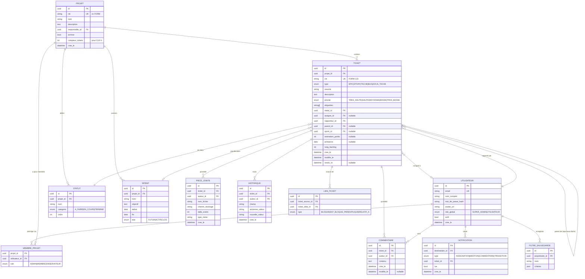
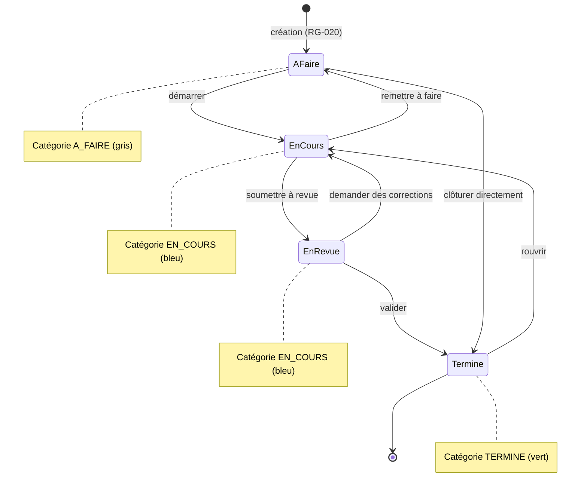

# Spécification Fonctionnelle Détaillée (SFD)
# GP-Formuloo — MVP V1.0

| Champ | Valeur |
|---|---|
| **Produit** | GP-Formuloo (mini Jira interne) |
| **Type de document** | Spécification Fonctionnelle Détaillée (SFD / SRS) |
| **Norme de référence** | Structure inspirée d'ISO/IEC/IEEE 29148:2018 (Requirements engineering) |
| **Version** | 1.0 |
| **Date** | 03/07/2026 |
| **Statut** | Draft — soumis à validation |
| **Auteur** | Équipe Formuloo (assisté par Claude) |
| **Approbateurs** | Direction Formuloo, Lead technique |
| **Document parent** | `01-analyse-fonctionnalites-jira-et-mvp.md` |

## Historique des révisions

| Version | Date | Auteur | Modifications |
|---|---|---|---|
| 0.1 | 03/07/2026 | Formuloo | Première ébauche |
| 1.0 | 03/07/2026 | Formuloo | Version complète soumise à validation |

---

## Table des matières

1. [Introduction](#1-introduction)
2. [Description générale](#2-description-générale)
3. [Acteurs et personas](#3-acteurs-et-personas)
4. [Modèle de données conceptuel](#4-modèle-de-données-conceptuel)
5. [Exigences fonctionnelles détaillées](#5-exigences-fonctionnelles-détaillées)
6. [Règles de gestion transverses](#6-règles-de-gestion-transverses)
7. [Matrice des permissions](#7-matrice-des-permissions)
8. [Exigences non fonctionnelles](#8-exigences-non-fonctionnelles)
9. [Matrice de traçabilité](#9-matrice-de-traçabilité)
10. [Critères d'acceptation globaux (Definition of Done)](#10-critères-dacceptation-globaux)
11. [Glossaire](#11-glossaire)

---

## 1. Introduction

### 1.1 Objet du document
Ce document spécifie de manière exhaustive, non ambiguë et vérifiable les exigences fonctionnelles et non fonctionnelles du **MVP de GP-Formuloo**, l'outil interne de gestion de projet destiné à remplacer Jira Cloud (plan Free) chez Formuloo. Il sert de référence contractuelle entre les parties prenantes métier et l'équipe de développement, et de base aux plans de tests.

### 1.2 Portée (scope)
- **Dans le périmètre** : les 34 exigences « Must » identifiées dans le document d'analyse (§3.2 du document parent) — comptes et permissions, projets, tickets, workflow, boards, agile (backlog/sprints/epics), recherche, reporting de base, notifications, automatisations pré-câblées, administration, import/export.
- **Hors périmètre MVP** : JQL, champs personnalisés, éditeur graphique de workflow, roadmap multi-projets, automatisation no-code générique, SSO, applications mobiles natives, intégrations tierces (Git, Slack).

### 1.3 Conventions du document
- **Identifiants** : `EF-xx.y` = exigence fonctionnelle ; `RG-xxx` = règle de gestion ; `ENF-xx` = exigence non fonctionnelle ; `US-xx` = user story.
- **Vocabulaire normatif** (RFC 2119) : **DOIT** (obligatoire), **DEVRAIT** (recommandé), **PEUT** (optionnel).
- **Priorités** : P0 = bloquant pour la mise en service ; P1 = requis pour le MVP ; P2 = souhaitable dans le MVP si le planning le permet.
- Les critères d'acceptation des exigences majeures sont exprimés en **Gherkin** (Étant donné / Quand / Alors).

### 1.4 Références
| Réf. | Document |
|---|---|
| [R1] | `01-analyse-fonctionnalites-jira-et-mvp.md` — inventaire et priorisation |
| [R2] | ISO/IEC/IEEE 29148:2018 — Ingénierie des exigences |
| [R3] | RFC 2119 — Mots-clés d'exigence |
| [R4] | OWASP ASVS 4.0 — Exigences de sécurité applicative (référence pour §8) |

---

## 2. Description générale

### 2.1 Vision produit
> Pour **les équipes de Formuloo**, qui **subissent les limitations du plan gratuit de Jira** (10 utilisateurs, permissions absentes, quotas), **GP-Formuloo** est **un outil web interne de gestion de projet agile** qui **fournit tickets, boards, sprints, permissions et rapports sans aucune limite de licence**. Contrairement à **Jira Free**, notre produit **appartient à Formuloo, est auto-hébergé, illimité en utilisateurs et gratuit à l'usage**.

### 2.2 Positionnement dans le SI
Application web autonome (client web + API + base de données + stockage de fichiers), auto-hébergée sur l'infrastructure choisie par Formuloo. Aucune dépendance à un service Atlassian. L'import initial des données se fait par fichier CSV exporté depuis Jira.

### 2.3 Hypothèses et contraintes
| ID | Hypothèse / Contrainte |
|---|---|
| H-1 | Les utilisateurs disposent d'un navigateur moderne (Chrome, Firefox, Edge, Safari ≤ 2 ans) |
| H-2 | La connectivité internet à Douala peut être intermittente → l'application DOIT rester légère et tolérante aux latences |
| C-1 | Langue de l'interface : **français** (l'anglais est prévu en V1.1) |
| C-2 | L'application DOIT fonctionner sur mobile via navigateur (responsive), sans app native |
| C-3 | Les données restent la propriété exclusive de Formuloo (hébergement maîtrisé) |
| C-4 | Budget licence : 0 — uniquement des composants open source |

### 2.4 Dépendances
- Un serveur SMTP (ou service d'emailing) pour les notifications par courriel (EF-9.2).
- Un export CSV de l'instance Jira actuelle pour la migration initiale (EF-11.3).

---

## 3. Acteurs et personas

### 3.1 Rôles système

| Rôle | Portée | Description |
|---|---|---|
| **Super Admin** | Instance | Gère l'instance : utilisateurs, projets, référentiels, sauvegardes. Au moins 1, idéalement 2. |
| **Admin de projet** | Projet | Configure son projet : statuts, membres, rôles, automatisations, archivage. |
| **Membre** | Projet | Travaille : crée/édite des tickets, commente, déplace sur le board, participe aux sprints. |
| **Observateur** | Projet | Lecture seule : consulte tickets, boards et rapports ; ne modifie rien. |

### 3.2 Personas

| Persona | Rôle type | Objectifs | Frustrations actuelles (Jira Free) |
|---|---|---|---|
| **Amina, cheffe de projet** | Admin de projet | Planifier les sprints, suivre l'avancement, produire des rapports | Pas de permissions : n'importe qui modifie le backlog ; rapports limités |
| **Serge, développeur** | Membre | Voir ses tickets, mettre à jour les statuts vite, être notifié des mentions | Notifications email plafonnées ; lenteurs |
| **Diane, direction** | Observateur | Vue d'ensemble fiable sans risquer de casser quoi que ce soit | Doit compter sur des captures d'écran ; limite de 10 comptes |
| **Kevin, ops/IT** | Super Admin | Gérer les comptes, garantir sauvegardes et sécurité | Aucune maîtrise des données chez Atlassian |

---

## 4. Modèle de données conceptuel



### 4.1 Workflow par défaut d'un ticket



> Au MVP, **toutes les transitions entre statuts sont autorisées** (workflow ouvert, comme le défaut des projets team-managed de Jira). Les conditions/validateurs arrivent en V1.1 (EF hors périmètre).

---

## 5. Exigences fonctionnelles détaillées

### EF-1 — Comptes, authentification et profils

| ID | Exigence | Priorité |
|---|---|---|
| EF-1.1 | Le système DOIT permettre à un Super Admin de créer un compte utilisateur (email unique, nom complet, mot de passe initial ou lien d'invitation). Le nombre de comptes est **illimité**. | P0 |
| EF-1.2 | Le système DOIT authentifier l'utilisateur par email + mot de passe et ouvrir une session sécurisée. | P0 |
| EF-1.3 | Le système DOIT permettre la réinitialisation du mot de passe par email. | P1 |
| EF-1.4 | Chaque utilisateur DOIT pouvoir modifier son profil : nom affiché, avatar, mot de passe. | P1 |
| EF-1.5 | Un Super Admin DOIT pouvoir **désactiver** un compte : l'utilisateur ne peut plus se connecter, mais tout son historique (tickets, commentaires) est conservé et reste attribué. | P0 |
| EF-1.6 | Un compte désactivé NE DOIT PAS être supprimable si des données lui sont rattachées (intégrité de l'historique). | P1 |

**Critères d'acceptation (EF-1.5)**
```gherkin
Étant donné un utilisateur "Serge" avec 42 tickets rapportés et 10 commentaires
Quand le Super Admin désactive le compte de Serge
Alors Serge ne peut plus se connecter
Et les 42 tickets affichent toujours "Serge" comme rapporteur
Et Serge n'apparaît plus dans les listes d'assignation
```

### EF-2 — Gestion des projets

| ID | Exigence | Priorité |
|---|---|---|
| EF-2.1 | Un Super Admin DOIT pouvoir créer un projet avec : nom (obligatoire), clé (2–10 caractères A-Z, unique, ex. `FORM`), description, responsable. | P0 |
| EF-2.2 | La clé du projet NE DOIT PAS être modifiable après création (stabilité des références `CLE-N`). | P0 |
| EF-2.3 | Le système DOIT supporter plusieurs projets simultanés, chacun avec ses membres, statuts, sprints et tickets isolés. | P0 |
| EF-2.4 | Un Admin de projet DOIT pouvoir ajouter/retirer des membres et leur attribuer un rôle (Admin, Membre, Observateur). | P0 |
| EF-2.5 | Un Admin de projet DOIT pouvoir **archiver** le projet : il disparaît des listes par défaut, ses données restent consultables en lecture seule, et il peut être désarchivé. | P1 |
| EF-2.6 | Un Admin de projet DOIT pouvoir personnaliser la liste ordonnée des statuts du projet (ajouter, renommer, réordonner, supprimer un statut vide), chaque statut appartenant à une catégorie (À faire / En cours / Terminé). | P1 |
| EF-2.7 | Chaque projet DOIT être créé avec le workflow par défaut du §4.1 (4 statuts). | P0 |

**Règles de gestion associées**
- **RG-010** : la suppression d'un statut n'est possible que s'il ne contient aucun ticket.
- **RG-011** : un projet doit toujours avoir au moins un statut de chaque catégorie (À faire, En cours, Terminé).
- **RG-012** : l'archivage d'un projet clôt automatiquement toute session de modification en cours sur ses tickets.

### EF-3 — Tickets (work items)

| ID | Exigence | Priorité |
|---|---|---|
| EF-3.1 | Un Membre DOIT pouvoir créer un ticket avec : type (Epic, Story, Tâche, Bug, Sous-tâche), résumé (obligatoire, ≤ 255 car.), description (texte riche basique : gras, italique, listes, code, liens), priorité (défaut : Moyenne), assigné, étiquettes, échéance, estimation en points, rattachement (epic parent ou ticket parent pour une sous-tâche), sprint. | P0 |
| EF-3.2 | Le système DOIT attribuer automatiquement une clé unique et immuable `CLE-N` (N = compteur croissant par projet, jamais réutilisé). | P0 |
| EF-3.3 | Tout champ d'un ticket DOIT être éditable individuellement (édition en place) par un utilisateur autorisé. | P0 |
| EF-3.4 | Le système DOIT supporter la hiérarchie : Epic → (Story, Tâche, Bug) → Sous-tâche. Une sous-tâche a obligatoirement un parent ; un Epic ne peut pas avoir de parent. | P0 |
| EF-3.5 | Un utilisateur autorisé DOIT pouvoir lier deux tickets avec un type de lien : « bloque », « est bloqué par », « duplique », « est relatif à ». Les liens inverses sont créés automatiquement. | P1 |
| EF-3.6 | Un utilisateur autorisé DOIT pouvoir commenter un ticket, éditer et supprimer **ses propres** commentaires. | P0 |
| EF-3.7 | Le système DOIT supporter la mention `@utilisateur` dans descriptions et commentaires, avec auto-complétion sur les membres du projet, et générer une notification (EF-9). | P1 |
| EF-3.8 | Un utilisateur autorisé DOIT pouvoir joindre des fichiers à un ticket (tous types ; taille max configurable, défaut 20 Mo/fichier), prévisualiser les images, télécharger et supprimer les pièces jointes. | P1 |
| EF-3.9 | Le système DOIT tracer dans l'historique du ticket toute modification : champ modifié, ancienne et nouvelle valeur, auteur, horodatage. L'historique est en lecture seule. | P0 |
| EF-3.10 | La suppression d'un ticket DOIT être réservée aux Admins de projet et DOIT demander une confirmation explicite. Les sous-tâches sont supprimées avec leur parent. | P1 |
| EF-3.11 | Le passage d'un ticket vers un statut de catégorie « Terminé » DOIT renseigner `resolu_le` ; toute sortie de cette catégorie DOIT l'effacer. | P1 |

**Critères d'acceptation (EF-3.2)**
```gherkin
Étant donné le projet "FORM" dont le compteur de tickets vaut 41
Quand Amina crée un nouveau ticket "Corriger le formulaire de contact"
Alors le ticket reçoit la clé "FORM-42"
Et le compteur du projet vaut 42
Et si "FORM-42" est supprimé puis qu'un nouveau ticket est créé
Alors ce nouveau ticket reçoit "FORM-43" (jamais "FORM-42")
```

**Critères d'acceptation (EF-3.4)**
```gherkin
Étant donné une Story "FORM-10"
Quand Serge crée une sous-tâche depuis "FORM-10"
Alors la sous-tâche est rattachée à "FORM-10" et visible dans son panneau "Sous-tâches"
Et il est impossible de créer une sous-tâche sans parent
Et il est impossible de rattacher un Epic à un autre ticket comme enfant
```

### EF-4 — Workflow et transitions

| ID | Exigence | Priorité |
|---|---|---|
| EF-4.1 | Un utilisateur autorisé DOIT pouvoir changer le statut d'un ticket depuis la vue ticket (menu de statuts) ou par glisser-déposer sur le board. | P0 |
| EF-4.2 | Au MVP, toute transition entre statuts du projet DOIT être possible (workflow ouvert). | P0 |
| EF-4.3 | Chaque changement de statut DOIT être historisé (EF-3.9) et déclencher les notifications configurées (EF-9). | P0 |

### EF-5 — Boards (Kanban et Sprint)

| ID | Exigence | Priorité |
|---|---|---|
| EF-5.1 | Chaque projet DOIT offrir un **board Kanban** : une colonne par statut (dans l'ordre configuré), cartes affichant clé, type (icône), résumé, priorité, assigné (avatar), points d'estimation, étiquettes. | P0 |
| EF-5.2 | Le glisser-déposer d'une carte entre colonnes DOIT changer le statut du ticket ; le glisser-déposer vertical DOIT réordonner les tickets dans la colonne. | P0 |
| EF-5.3 | Le board DOIT proposer des **filtres rapides** : « Mes tickets », recherche texte instantanée, filtre par type, par assigné, par étiquette, par epic. Les filtres se combinent. | P1 |
| EF-5.4 | En mode Scrum, le board DOIT afficher uniquement les tickets du **sprint actif**, avec le nom et l'objectif du sprint en en-tête, et le nombre de jours restants. | P0 |
| EF-5.5 | Les sous-tâches DOIVENT apparaître sur le board du sprint de leur parent. | P2 |

### EF-6 — Backlog, sprints et epics

| ID | Exigence | Priorité |
|---|---|---|
| EF-6.1 | Chaque projet DOIT offrir une vue **Backlog** : liste ordonnée des tickets non planifiés et non terminés, réordonnable par glisser-déposer (rang persistant). | P0 |
| EF-6.2 | Un Admin ou Membre DOIT pouvoir créer un sprint (nom auto « Sprint N », objectif, dates prévisionnelles) et y glisser des tickets depuis le backlog. | P0 |
| EF-6.3 | Le démarrage d'un sprint DOIT exiger : au moins 1 ticket, une date de début et une date de fin. Un seul sprint actif par projet au MVP. | P0 |
| EF-6.4 | La clôture d'un sprint DOIT proposer le sort des tickets non terminés : retour au backlog ou déplacement vers un sprint suivant (créé à la volée si besoin). | P0 |
| EF-6.5 | La vue Backlog DOIT afficher pour chaque sprint et pour le backlog : nombre de tickets et somme des points d'estimation. | P1 |
| EF-6.6 | Un panneau **Epics** DOIT permettre de filtrer backlog et board par epic et d'afficher l'avancement de chaque epic (tickets terminés / total, points terminés / total). | P1 |

**Critères d'acceptation (EF-6.4)**
```gherkin
Étant donné le sprint actif "Sprint 7" contenant 10 tickets dont 3 non terminés
Quand Amina clôture "Sprint 7" en choisissant "Déplacer vers Sprint 8"
Alors le sprint passe à l'état CLOS
Et les 3 tickets non terminés sont rattachés à "Sprint 8"
Et les 7 tickets terminés restent rattachés à "Sprint 7" pour l'historique et la vélocité
Et le rapport de sprint de "Sprint 7" est consultable
```

### EF-7 — Recherche et filtres

| ID | Exigence | Priorité |
|---|---|---|
| EF-7.1 | Le système DOIT offrir une recherche globale plein texte (résumé, description, clé exacte, commentaires) restituant les tickets accessibles à l'utilisateur, triés par pertinence. | P0 |
| EF-7.2 | Le système DOIT offrir une recherche avancée combinant : projet(s), type(s), statut(s), priorité(s), assigné(s), rapporteur, étiquette(s), sprint, epic, dates de création/mise à jour/échéance (bornes). Les critères se cumulent en ET ; les valeurs multiples d'un même critère en OU. | P0 |
| EF-7.3 | Les résultats DOIVENT être triables (clé, priorité, création, mise à jour, échéance) et paginés. | P1 |
| EF-7.4 | Un utilisateur DOIT pouvoir **sauvegarder** une recherche sous un nom, la retrouver, la renommer, la supprimer. | P1 |
| EF-7.5 | La saisie de la clé exacte d'un ticket (ex. `FORM-42`) DOIT amener directement au ticket. | P1 |

### EF-8 — Tableaux de bord et rapports

| ID | Exigence | Priorité |
|---|---|---|
| EF-8.1 | L'écran d'accueil DOIT présenter : « Mes tickets en cours », « Tickets que je rapporte », activité récente sur mes projets, accès rapide aux projets et filtres sauvegardés. | P1 |
| EF-8.2 | Chaque projet DOIT proposer un **burndown chart** du sprint actif : points (ou nombre de tickets) restants par jour vs ligne idéale. | P1 |
| EF-8.3 | Chaque projet DOIT proposer un **rapport de vélocité** : points engagés vs points livrés pour les N derniers sprints clos (défaut : 7). | P1 |
| EF-8.4 | Chaque projet DOIT proposer des **répartitions** (graphiques) des tickets ouverts : par statut, par assigné, par priorité, par type. | P1 |
| EF-8.5 | Chaque rapport DOIT être exportable en image (PNG) ou les données sous-jacentes en CSV. | P2 |

### EF-9 — Notifications

| ID | Exigence | Priorité |
|---|---|---|
| EF-9.1 | Le système DOIT générer une notification **in-app** (cloche + compteur de non-lues + centre de notifications) pour : assignation d'un ticket, mention, commentaire sur un ticket où j'interviens (rapporteur/assigné), transition d'un de mes tickets. | P0 |
| EF-9.2 | Le système DOIT envoyer un **email** (si SMTP configuré) pour : assignation et mention. Les autres événements par email sont réglables par utilisateur. | P1 |
| EF-9.3 | Les notifications NE DOIVENT PAS être émises vers l'auteur de l'action (pas d'auto-notification). | P1 |
| EF-9.4 | L'utilisateur DOIT pouvoir marquer une notification (ou toutes) comme lue(s) ; un clic ouvre le ticket concerné. | P1 |

### EF-10 — Automatisations pré-câblées

| ID | Exigence | Priorité |
|---|---|---|
| EF-10.1 | Chaque projet DOIT proposer 4 règles activables/désactivables individuellement par un Admin de projet : (a) auto-assigner le ticket à son créateur si aucun assigné ; (b) quand toutes les sous-tâches sont terminées, proposer/passer le parent à « Terminé » ; (c) quand un ticket passe « En cours » sans assigné, l'assigner à l'auteur de la transition ; (d) notifier le rapporteur quand son ticket est terminé. | P1 |
| EF-10.2 | Les actions exécutées par une règle DOIVENT apparaître dans l'historique du ticket avec la mention « Automatisation ». | P1 |
| EF-10.3 | Aucune limite du nombre d'exécutions NE DOIT être imposée. | P0 |

### EF-11 — Administration, import/export et sauvegarde

| ID | Exigence | Priorité |
|---|---|---|
| EF-11.1 | Une console d'administration (Super Admin) DOIT regrouper : gestion des utilisateurs (EF-1), liste des projets (actifs/archivés), statistiques d'usage basiques (nb utilisateurs actifs, nb tickets, stockage consommé). | P1 |
| EF-11.2 | Un Super Admin DOIT pouvoir déclencher un **export complet** : données en JSON + pièces jointes, livrés en archive téléchargeable. | P1 |
| EF-11.3 | Le système DOIT offrir un **import CSV compatible avec l'export Jira** couvrant au minimum : clé, type, résumé, description, statut (mappé), priorité, étiquettes, assigné, rapporteur (mappés par email), dates de création/mise à jour, estimation, sprint, lien epic/parent. Un écran de mapping colonnes → champs avec prévisualisation et rapport d'erreurs DOIT être fourni. | P0 |
| EF-11.4 | Toute liste de tickets (recherche, backlog) DOIT être exportable en CSV. | P1 |

**Critères d'acceptation (EF-11.3)**
```gherkin
Étant donné un export CSV Jira de 350 tickets du projet Formuloo
Quand Kevin importe le fichier en mappant les colonnes proposées
Alors un écran de prévisualisation montre les 5 premières lignes interprétées
Et après confirmation, 350 tickets sont créés avec leurs types, statuts, priorités et assignés
Et les lignes en erreur (ex. email inconnu) sont listées dans un rapport téléchargeable
Et aucune ligne en erreur n'est partiellement importée
```

### EF-12 — Interface et ergonomie

| ID | Exigence | Priorité |
|---|---|---|
| EF-12.1 | L'interface DOIT être en français, responsive (desktop ≥ 1280 px, tablette, mobile ≥ 360 px). | P0 |
| EF-12.2 | La navigation principale DOIT donner accès en ≤ 2 clics à : mes projets, board, backlog, recherche, création de ticket, notifications, profil. | P1 |
| EF-12.3 | Un bouton global « Créer » DOIT ouvrir la création de ticket depuis n'importe quel écran, avec le projet courant présélectionné. | P1 |
| EF-12.4 | Le détail d'un ticket DOIT s'ouvrir en panneau latéral (ou modale) depuis le board/backlog sans perdre le contexte, et disposer d'une URL directe partageable. | P1 |

---

## 6. Règles de gestion transverses

| ID | Règle |
|---|---|
| RG-020 | À la création, un ticket prend le premier statut de catégorie « À faire » du projet. |
| RG-021 | Les valeurs de priorité sont : Très haute, Haute, Moyenne (défaut), Basse, Très basse. |
| RG-022 | Une étiquette est une chaîne libre de 1 à 50 caractères, sans espace de début/fin ; la casse est conservée mais l'unicité est insensible à la casse au sein d'un projet. |
| RG-023 | Un ticket ne peut être rattaché qu'à un sprint de son propre projet. |
| RG-024 | Un Epic ne peut pas être placé dans un sprint ; seuls Story, Tâche et Bug (et leurs sous-tâches, via le parent) sont sprintables. |
| RG-025 | L'estimation est un entier ≥ 0 (points). Les sous-tâches ne portent pas d'estimation au MVP. |
| RG-026 | Toute date affichée l'est dans le fuseau du navigateur de l'utilisateur ; toute date stockée l'est en UTC. |
| RG-027 | La vélocité d'un sprint = somme des points des tickets en catégorie « Terminé » au moment de la clôture. |
| RG-028 | Les liens « bloque / est bloqué par » sont symétriques inverses : créer l'un crée l'autre ; supprimer l'un supprime l'autre. |
| RG-029 | Un utilisateur ne voit que les projets dont il est membre (sauf Super Admin qui voit tout). |
| RG-030 | Le rang backlog est un ordre total persistant par projet ; l'insertion recalcule les rangs voisins sans réécrire toute la liste. |

---

## 7. Matrice des permissions

Légende : ✔ autorisé · ✖ interdit · (P) uniquement sur ses propres objets

| Action | Super Admin | Admin projet | Membre | Observateur |
|---|:---:|:---:|:---:|:---:|
| Créer / désactiver des utilisateurs | ✔ | ✖ | ✖ | ✖ |
| Créer / supprimer un projet | ✔ | ✖ | ✖ | ✖ |
| Archiver / désarchiver le projet | ✔ | ✔ | ✖ | ✖ |
| Configurer statuts et automatisations du projet | ✔ | ✔ | ✖ | ✖ |
| Gérer les membres et rôles du projet | ✔ | ✔ | ✖ | ✖ |
| Créer / démarrer / clôturer un sprint | ✔ | ✔ | ✔ | ✖ |
| Créer un ticket | ✔ | ✔ | ✔ | ✖ |
| Modifier un ticket (champs, statut, board) | ✔ | ✔ | ✔ | ✖ |
| Supprimer un ticket | ✔ | ✔ | ✖ | ✖ |
| Commenter | ✔ | ✔ | ✔ | ✖ |
| Éditer / supprimer un commentaire | ✔ (tous) | ✔ (tous) | (P) | ✖ |
| Ajouter / supprimer une pièce jointe | ✔ | ✔ | ✔ / (P) | ✖ |
| Consulter tickets, boards, rapports | ✔ | ✔ | ✔ | ✔ |
| Rechercher, sauvegarder des filtres | ✔ | ✔ | ✔ | ✔ |
| Importer CSV dans le projet | ✔ | ✔ | ✖ | ✖ |
| Export complet de l'instance | ✔ | ✖ | ✖ | ✖ |

> Toute tentative d'action non autorisée DOIT être refusée côté serveur (pas seulement masquée dans l'interface) avec un message explicite. — **exigence de sécurité, cf. ENF-05**

---

## 8. Exigences non fonctionnelles

| ID | Catégorie | Exigence | Cible / Mesure |
|---|---|---|---|
| ENF-01 | Performance | Chargement d'un board de 200 tickets | < 2 s (P95) |
| ENF-02 | Performance | Création / mise à jour d'un ticket | < 500 ms côté serveur (P95) |
| ENF-03 | Performance | Recherche plein texte sur 50 000 tickets | < 2 s (P95) |
| ENF-04 | Capacité | Volumétrie supportée sans dégradation | ≥ 100 utilisateurs, ≥ 50 projets, ≥ 100 000 tickets |
| ENF-05 | Sécurité | Contrôle d'accès systématiquement appliqué côté serveur ; mots de passe hachés (algorithme adaptatif type bcrypt/argon2) ; protection CSRF/XSS/injections ; sessions expirables | Revue sécurité alignée OWASP ASVS niveau 1 |
| ENF-06 | Sécurité | Les pièces jointes ne sont téléchargeables que par les membres du projet | Test d'accès direct par URL refusé |
| ENF-07 | Disponibilité | Service disponible aux heures ouvrées de Formuloo | ≥ 99 % mensuel (hors maintenance planifiée) |
| ENF-08 | Sauvegarde | Sauvegarde automatique quotidienne de la base + pièces jointes ; restauration testée | RPO ≤ 24 h, RTO ≤ 4 h |
| ENF-09 | Compatibilité | Navigateurs Chrome, Firefox, Edge, Safari (2 dernières versions majeures) ; mobile ≥ 360 px | Tests multi-navigateurs |
| ENF-10 | Sobriété réseau | Application utilisable sur connexion 3G/4G instable ; payload initial raisonnable | Bundle initial < 1 Mo gzippé ; états de chargement explicites |
| ENF-11 | Maintenabilité | Code versionné (Git), revue de code, tests automatisés sur les règles de gestion critiques (RG-020 à RG-030) | Couverture des règles critiques 100 % |
| ENF-12 | Auditabilité | Historique des tickets infalsifiable applicativement (aucune API de modification/suppression) | Revue de conception |
| ENF-13 | Localisation | Interface en français ; formats de date `JJ/MM/AAAA` ; fuseau par défaut Afrique/Douala (WAT) | Vérification UI |
| ENF-14 | Accessibilité | Contrastes suffisants, navigation clavier sur les écrans principaux | WCAG 2.1 niveau AA visé sur les parcours clés |

---

## 9. Matrice de traçabilité

Correspondance entre les exigences de cette SFD et l'inventaire du document d'analyse [R1] :

| Exigence SFD | IDs inventaire [R1] |
|---|---|
| EF-1 (comptes) | J-01, J-02, J-03, J-08 |
| EF-2 (projets) | A-01, A-02, A-05, A-09, C-01, C-02 |
| EF-3 (tickets) | B-01, B-02, B-04→B-07, B-09, B-10, B-12→B-14, B-16, B-17, B-23 |
| EF-4 (workflow) | C-01, C-02, C-03 |
| EF-5 (boards) | D-01, D-02, D-06 |
| EF-6 (agile) | E-01, E-02, E-03, E-04, E-07 |
| EF-7 (recherche) | F-01, F-02, F-04 |
| EF-8 (rapports) | G-01, G-03, G-05, G-10 |
| EF-9 (notifications) | H-01, H-02 |
| EF-10 (automatisation) | I-04 |
| EF-11 (admin/données) | K-01, K-07, L-03, L-04 |
| EF-12 (UX) | M-01 |
| §7 (permissions) | J-04, J-05 |

Toute exigence « Must » de [R1] est couverte ; réciproquement, aucune exigence de cette SFD ne sort du périmètre Must. ✔

---

## 10. Critères d'acceptation globaux

Le MVP est **accepté** lorsque l'ensemble des conditions suivantes est vérifié :

1. **Fonctionnel** : toutes les exigences P0 sont livrées et testées ; ≥ 90 % des P1 livrées ; les critères Gherkin de la SFD passent en recette.
2. **Migration** : l'import de l'export CSV Jira réel de Formuloo réussit (critère CS-1 de [R1]) et un contrôle par échantillonnage de 20 tickets ne révèle aucune divergence de champ standard.
3. **Permissions** : la matrice du §7 est vérifiée par une campagne de tests par rôle (aucune action interdite possible, y compris par appel direct à l'API).
4. **Performance** : ENF-01 à ENF-03 mesurées et conformes sur un jeu de données représentatif (2× la volumétrie actuelle de Formuloo).
5. **Exploitation** : une sauvegarde complète et une restauration ont été exécutées avec succès en environnement de préproduction (ENF-08).
6. **Adoption** : un sprint réel complet (planification → exécution → clôture → rapports) a été conduit par une équipe pilote de Formuloo dans l'outil.

---

## 11. Glossaire

| Terme | Définition |
|---|---|
| **Backlog** | Liste ordonnée des tickets à réaliser, non encore planifiés dans un sprint. |
| **Board (tableau)** | Vue en colonnes des tickets, chaque colonne correspondant à un statut. |
| **Burndown** | Graphique du travail restant d'un sprint au fil des jours. |
| **Epic** | Ticket de haut niveau regroupant plusieurs stories/tâches/bugs. |
| **Kanban** | Méthode de gestion visuelle en flux continu, sans itérations. |
| **MoSCoW** | Méthode de priorisation : Must / Should / Could / Won't have. |
| **MVP** | Minimum Viable Product : plus petit produit livrant la valeur essentielle. |
| **Scrum** | Cadre agile organisé en itérations (sprints) avec objectifs. |
| **SFD / SRS** | Spécification Fonctionnelle Détaillée / Software Requirements Specification. |
| **Sprint** | Itération de durée fixe (généralement 1 à 4 semaines) avec un objectif. |
| **Statut** | Étape du cycle de vie d'un ticket (ex. À faire, En cours, Terminé). |
| **Story point** | Unité relative d'estimation de l'effort d'un ticket. |
| **Ticket (issue / work item)** | Unité de travail suivie : story, tâche, bug, epic ou sous-tâche. |
| **Vélocité** | Somme des points livrés par sprint ; indicateur de capacité de l'équipe. |
| **WIP limit** | Limite du nombre de tickets simultanés dans une colonne (hors MVP). |
| **Workflow** | Ensemble des statuts et transitions régissant le cycle de vie d'un ticket. |

---

*Fin du document — toute modification doit passer par une nouvelle version tracée dans l'historique des révisions.*
